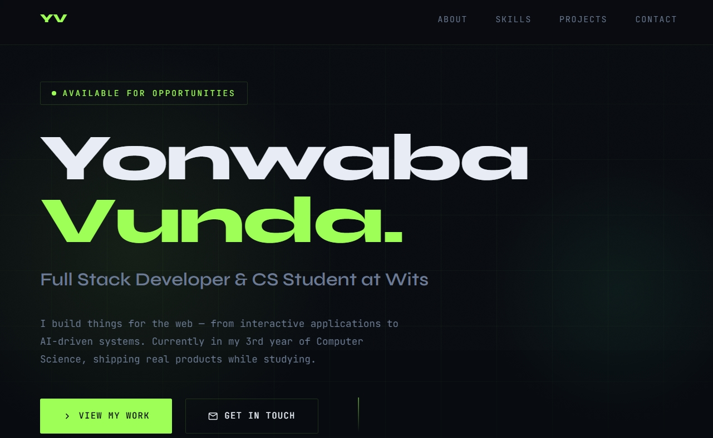

# Yonwaba Vunda — Developer Portfolio

A clean, responsive, and professional portfolio website built to showcase my skills, projects, and background as a Computer Science student at the University of the Witwatersrand (Wits).

> **Live Site:** [your-url-here.netlify.app](https://yonwabavunda.netlify.app)

---

## Preview



---

## About the Project

This portfolio serves as my digital resume and proof of work — a single place where recruiters, collaborators, and clients can see what I build and how I think as a developer.

It was built as part of my **Future Interns Full Stack Web Development internship**

---

## Features

- **Hero section** with animated entrance and availability badge
- **About section** with background, goals, and education details
- **Skills section** grouped by category (Languages, Web, Cloud, Systems)
- **Projects section** showcasing 5 real projects with live links
- **Contact section** with direct email, GitHub and LinkedIn links
- **Responsive design** — works on mobile, tablet, and desktop
- **Scroll-reveal animations** on all sections
- **Custom animated cursor** with hover scaling effect
- **Active nav highlighting** as you scroll through sections
- **SEO-friendly** meta description and semantic HTML structure
- **Zero dependencies** — single `index.html`, no build tools required

---

## Tech Stack

| Layer       | Technology                        |
|-------------|-----------------------------------|
| Markup      | HTML5 (semantic)                  |
| Styling     | CSS3 (custom properties, animations, grid, flexbox) |
| Scripting   | Vanilla JavaScript (ES6+)         |
| Fonts       | Google Fonts — Syne + JetBrains Mono |
| Hosting     | Netlify / GitHub Pages    |

---

## Project Structure

```
FUTURE_FS_01/
├── index.html       # Complete portfolio — all HTML, CSS, and JS in one file
├── README.md        # Project documentation
└── preview.jpeg      # Screenshot for README preview
```

---

## Setup & Local Development

No build tools, no package managers, no configuration required.

### Option 1 — Open directly in browser

```bash
# Clone the repository
git clone https://github.com/YonwabaVunda/FUTURE_FS_01.git

# Navigate into the folder
cd FUTURE_FS_01

# Open in your default browser
open index.html          # macOS
start index.html         # Windows
xdg-open index.html      # Linux
```

### Option 2 — Use VS Code Live Server (recommended for development)

1. Open the project folder in [Visual Studio Code](https://code.visualstudio.com/)
2. Install the **Live Server** extension by Ritwick Dey
3. Right-click `index.html` → **Open with Live Server**
4. Your browser opens at `http://127.0.0.1:5500` with live reload on save

---
## Customisation Guide

To update content, open `index.html` in any text editor and find these sections:

| What to change         | Search for this in the file             |
|------------------------|-----------------------------------------|
| Your name / title      | `hero-name`, `hero-title`               |
| About text             | `about-text`                            |
| Education details      | `edu-card`                              |
| Skills list            | `skill-group` blocks                    |
| Projects               | `project-card` blocks                   |
| Contact links          | `contact-links`                         |
| Accent colour          | `--accent: #9eff57;` in `:root`         |
| Fonts                  | Google Fonts `<link>` + `--ff-head` / `--ff-mono` |

---


## Author

**Yonwaba Vunda**
- Email: [vundayonwaba@gmail.com](mailto:vundayonwaba@gmail.com)
- GitHub: [github.com/YonwabaVunda](https://github.com/YonwabaVunda)
- LinkedIn: [linkedin.com/in/yonwaba-vunda](https://linkedin.com/in/yonwaba-vunda)

---

